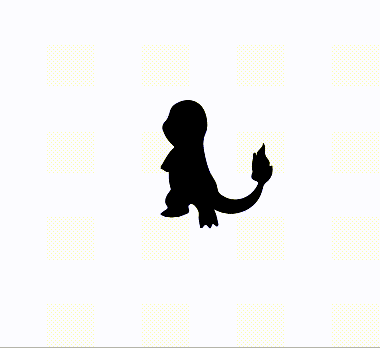
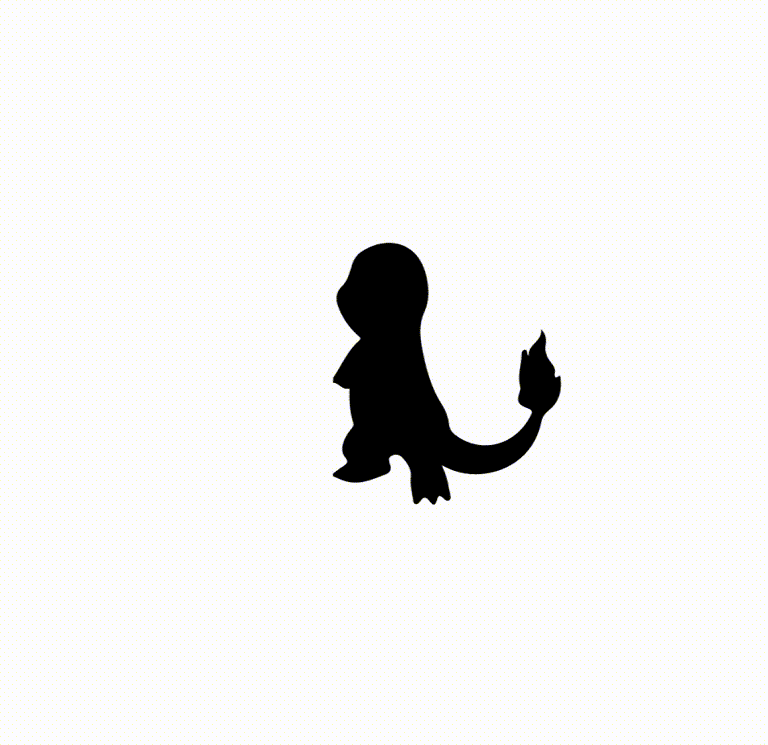

# Polymorph

*Morph SVG Paths*

[](https://badge.fury.io/js/polymorph-js)
[](https://travis-ci.org/notoriousb1t/polymorph)
[](https://www.npmjs.com/package/polymorph-js)
[](https://unpkg.com/polymorph-js/dist/polymorph.min.js) [](https://greenkeeper.io/)

## Features

 - morphs between two or more svg paths using a simple function
 - handles variable length paths and holes in paths
 - compatible with [Just Animate](https://github.com/just-animate/just-animate), [Popmotion](https://github.com/popmotion/popmotion), [nm8](https://github.com/davidkpiano/nm8), [TweenRex](https://github.com/tweenrex/tweenrex), and other animation libraries
 - Super tiny, about 6k minified
 - Free for commercial and non-commerical use under the MIT license

<table>
    <tbody>
        <tr>
        <td style="text-align: center;"><h3>Flubber (53kb)</h3></td>
        <td style="text-align: center;"><h3>Polymorph  (6kb)</h3></td>
        </tr>
        <tr>
            <td>
            
            </td>
            <td>
                
            </td>
        </tr>
    </tbody>
</table>

## Demos
- [Morph Leonardo da Vinci to a Skull](https://codepen.io/notoriousb1t/pen/KyPoYm)
- [Charmander Evolves with Just Animate 2 + Polymorph](https://codepen.io/notoriousb1t/pen/gXpYEG?editors=1010)
- [Morphin' Icons with Just Animate 2 + Polymorph](https://codepen.io/notoriousb1t/pen/veMyxw?editors=1010)

## How to Use

### interpolate(paths, options)
Returns a function that interpolates between two or more paths.

```js
// create function to interpolate between the two paths
const interpolator = polymorph.interpolate(['#play', '#pause'], {
   addPoints: 0,
   origin: { x: 0, y: 0 },
   optimize: 'fill',
   precision: 0
})

// pass a number between 0 and 1. 0.5 is 50% in the middle.
const midway = interpolator(0.5)
```

#### paths
An array of path data.  Each item can be a PathElement, a CSS selector, or a path string ('M0,0 ...')

#### options
Name | Description |
--- | --- |
addPoints | Adds additional points to each side of the tween over what is required.  This takes effect when optimize is set to ```fill```.  The default value is ```0```. |
origin | There are two modes to origin: absolute and relative. When absolute is true, ```x``` and ```y``` are exact coordinates in the SVG space.  When absolute is false, ```x``` and ```y``` are values between ```0``` and ```1``` representing 0% to 100% of the bounding box of the path. This is similar to transform-origin in CSS.  The default value is ```{ x: 0, y: 0, absolute: false }``` (upper left corner of the bounding box of the path) |
optimize | Determines the strategy for aligning two disparate shapes. ```none``` does nothing.  ```fill``` creates new subpaths as needed and inserts additional points as needed.  The default value is ```fill```. |
precision | The number of decimal places to use when rendering paths.  Increasing this value smoothes out shapes at the cost of browser rendering speed.  The default value is ```0``` |

## Setup

### Setup for CDN
Include this script
```html
<script src="https://unpkg.com/polymorph-js/dist/polymorph.min.js"></script>
```

### Setup for NPM
```bash
npm install polymorph-js --save
```

## License
This library is licensed under MIT.

## Contributions / Questions
Please create an issue for questions or to discuss new features.
